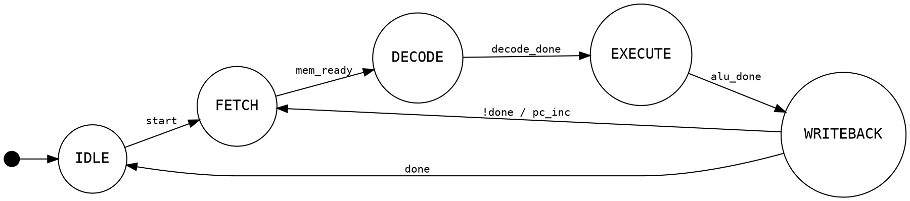
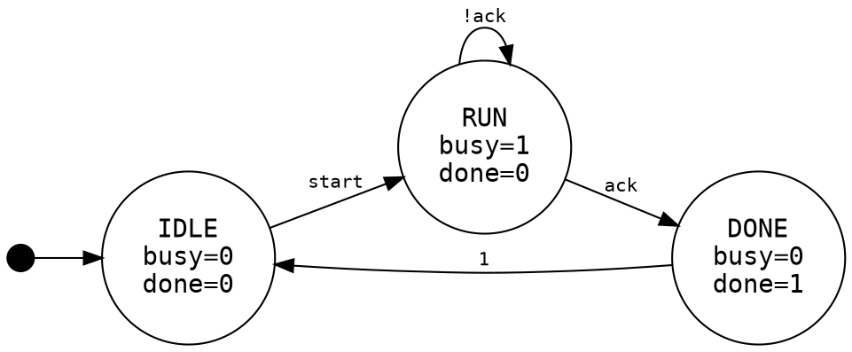
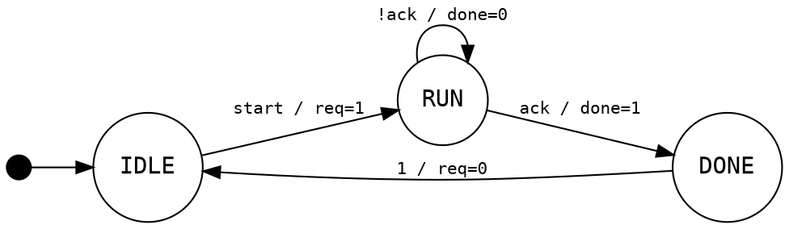

# Graphviz DOT FSM Diagrams

Use DOT for RTL documentation when the user does not require Mermaid. DOT is compact, renders cleanly to SVG/PNG, and maps naturally to hardware-style state names and signal labels.

## Basic RTL FSM



Render with:

```bash
dot -Tsvg fsm.dot -o fsm.svg
dot -Tpng fsm.dot -o fsm.png
```

## Moore Annotation

Put state-dependent outputs in the state node label.



## Mealy Annotation

Put input-dependent outputs on transition labels.



## Conventions

- Use `rankdir=LR` for hardware flow diagrams.
- Use uppercase state names when matching RTL constants.
- Use `!sig`, `sig_a && sig_b`, and `count == N` style labels to match RTL.
- Add reset with a point node named `__start`.
- Use `doublecircle` only for accepting/final states, not normal idle states unless finality matters.
