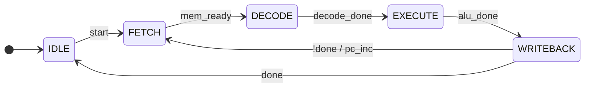
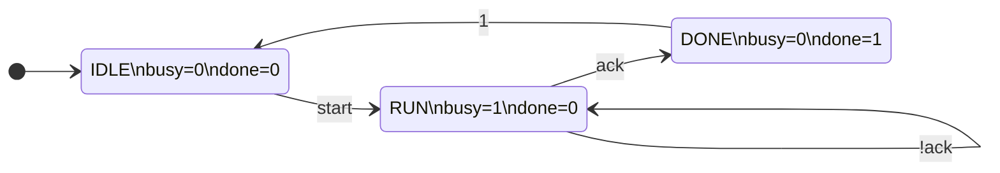
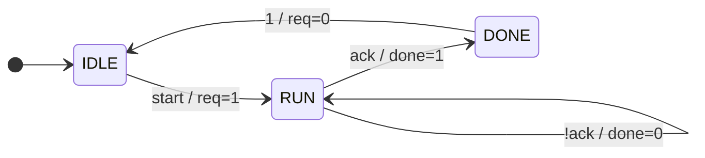
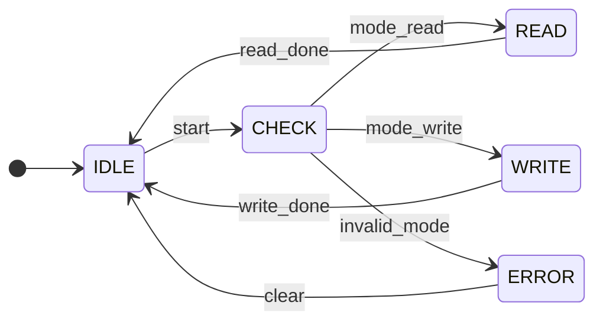

# Mermaid FSM Diagrams

Use Mermaid `stateDiagram-v2` when the diagram must render directly in Markdown or the user asks for Mermaid.

## Basic RTL FSM

## Moore-Style Labels

For Moore machines, show state outputs in notes or state labels.

## Mealy-Style Labels

For Mealy machines, put output actions on transitions.

## Branching

## Conventions

- Prefer `direction LR` for hardware control paths.
- Use exact RTL signal names in labels.
- Use `event [guard] / action` for combined conditions and side effects.
- Keep diagrams flat unless hierarchy is part of the actual architecture.
