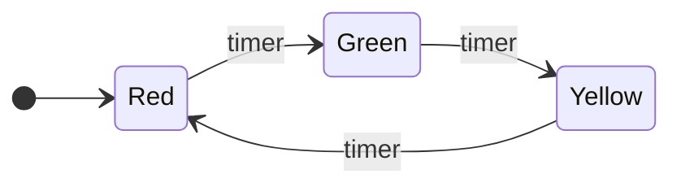
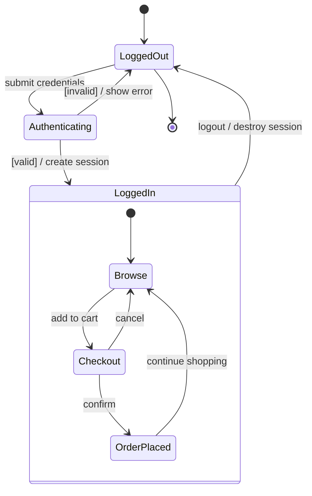
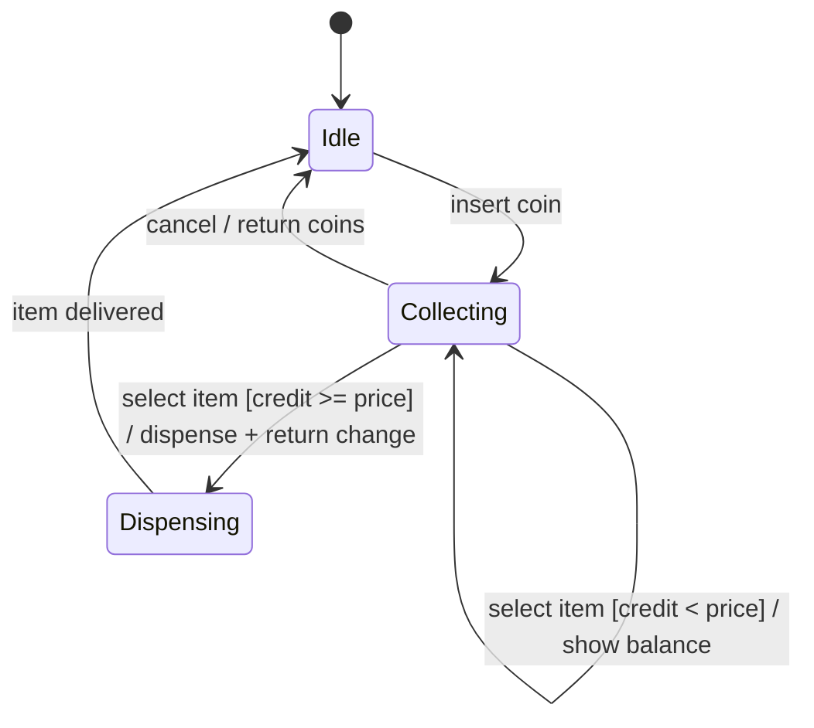
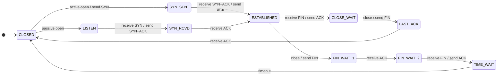
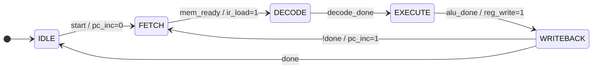
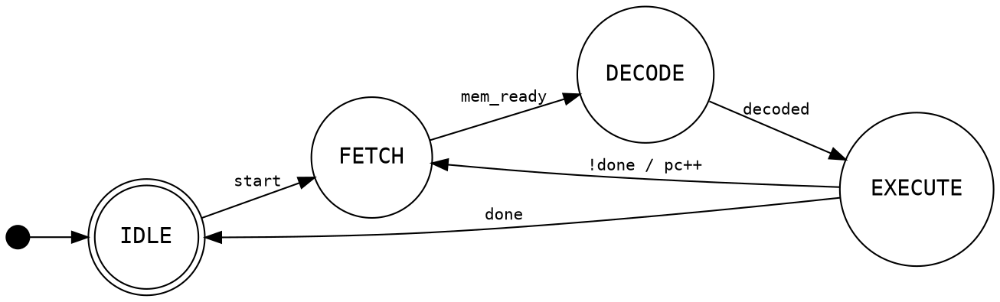
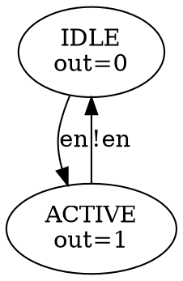

# FSM Skill

## Overview

This skill produces **Mermaid `stateDiagram-v2`** — the cleanest text-based format for FSM diagrams — from plain-English descriptions or structured specs. The output can be pasted directly into the [Mermaid Live Editor](https://mermaid.live), renders natively in GitHub/GitLab Markdown, and can be exported to SVG/PNG via the Mermaid CLI.

For hardware/RTL contexts (where Graphviz DOT is more conventional), see **DOT Output** below.

## Workflow

1. **Identify the states** — enumerate distinct modes, phases, or conditions the system can be in
2. **Identify the transitions** — for each state, what events or conditions cause a state change, and what actions occur
3. **Identify initial and final states** — `[*]` is used for both
4. **Choose complexity level** — flat FSM, hierarchical (nested states), or concurrent (parallel regions)
5. **Compose the diagram** — write the Mermaid stateDiagram-v2 block
6. **Output a fenced code block** using ` ```mermaid ` so it renders cleanly, then explain what it shows
7. **Optionally render to a file** — if the user wants SVG/PNG, offer to run `mmdc` (see **Rendering to Image Files**)

## Mermaid stateDiagram-v2 Reference

### Basic structure

```
stateDiagram-v2
    [*] --> Idle
    Idle --> Running : start
    Running --> Idle : stop
    Running --> Error : fault
    Error --> Idle : reset
    Idle --> [*]
```

### States

```
stateDiagram-v2
    %% Plain state (name is the label)
    Idle

    %% State with a display label (name used internally, label shown)
    state "Waiting for ACK" as WaitAck

    %% Initial pseudostate
    [*] --> Idle

    %% Final pseudostate
    Done --> [*]
```

### Transitions

```
stateDiagram-v2
    %% Transition with event label
    A --> B : event

    %% Transition with event and action
    A --> B : event / action()

    %% Transition with guard condition
    A --> B : [condition]

    %% Combined
    A --> B : event [guard] / action()

    %% Unlabelled transition (useful from [*])
    [*] --> Init
```

### Composite (nested) states

```
stateDiagram-v2
    [*] --> Active

    state Active {
        [*] --> Idle
        Idle --> Processing : request
        Processing --> Idle : done
    }

    Active --> Stopped : shutdown
    Stopped --> [*]
```

### Choice pseudostate (branching)

```
stateDiagram-v2
    [*] --> Check

    state Check <<choice>>
    Check --> Authorized : [valid credentials]
    Check --> Denied : [invalid credentials]

    Authorized --> Session
    Denied --> [*]
```

### Fork and join (parallel split/merge)

```
stateDiagram-v2
    [*] --> Fork1

    state Fork1 <<fork>>
    Fork1 --> DownloadA
    Fork1 --> DownloadB

    state Join1 <<join>>
    DownloadA --> Join1
    DownloadB --> Join1

    Join1 --> Done
    Done --> [*]
```

### Concurrent regions (parallel states)

Use `--` to split a composite state into parallel regions:

```
stateDiagram-v2
    state Active {
        state "Audio" as Audio {
            [*] --> Muted
            Muted --> Playing : unmute
            Playing --> Muted : mute
        }
        --
        state "Video" as Video {
            [*] --> Paused
            Paused --> Streaming : play
            Streaming --> Paused : pause
        }
    }
```

### Notes

```
stateDiagram-v2
    Idle --> Running : start
    note right of Running
        CPU usage increases here.
        Monitor for thermal throttling.
    end note
```

### Direction

```
stateDiagram-v2
    direction LR    %% Left-to-right (good for sequential flows)
    %% Default is top-to-bottom
```

### Comments and styling

```
stateDiagram-v2
    %% This is a comment

    classDef error fill:#f55,color:#fff
    class Error error
```

## Common Patterns

### Traffic light



### Login flow



### Vending machine



### TCP connection states



### Hardware RTL FSM (Moore, use DOT for this — see below)

For Mermaid:


## DOT Output (Hardware/RTL Context)

Graphviz DOT is the conventional choice for RTL documentation — pairs naturally with WaveDrom, produces minimal clean diagrams, and is programmatically easy to generate from code.

### Basic DOT FSM



### Mealy vs Moore annotation in DOT



Render DOT with:
```bash
dot -Tsvg fsm.dot -o fsm.svg
dot -Tpng fsm.dot -o fsm.png
```

## Output Format

Always output the diagram as a fenced code block. For Mermaid:

````

````

For DOT:

````
```dot
digraph FSM {
    ...
}
```
````

After the code block, briefly explain:
- What states exist and what each represents
- Key transitions or decision points
- How to use it: paste at https://mermaid.live (for Mermaid) or https://dreampuf.github.io/GraphvizOnline/ (for DOT)

If the description is ambiguous about exact transitions or guards, make a reasonable assumption, note it, and offer to adjust.

## Rendering to Image Files

### Mermaid CLI (`mmdc`)

```bash
# Install (requires Node.js)
npm install -g @mermaid-js/mermaid-cli

# Save diagram
cat > fsm.mmd << 'EOF'
stateDiagram-v2
    [*] --> Idle
    Idle --> Running : start
EOF

# Render
mmdc -i fsm.mmd -o fsm.svg          # SVG (best for docs)
mmdc -i fsm.mmd -o fsm.png          # PNG
mmdc -i fsm.mmd -o fsm.pdf          # PDF
```

### Graphviz

```bash
# Install: brew install graphviz  OR  apt install graphviz
dot -Tsvg fsm.dot -o fsm.svg
dot -Tpng fsm.dot -o fsm.png
```

### When to offer rendering

- User asks to "save", "export", or "generate" a file
- User mentions embedding in a document or slides
- Bash tool access is available — check with `which mmdc` or `which dot` and suggest install if missing

## Choosing the Right Format

| Situation | Use |
|---|---|
| Software FSM, web docs, GitHub README | Mermaid `stateDiagram-v2` |
| Hardware / RTL / FPGA documentation | Graphviz DOT |
| Need to simulate or execute the FSM | XState JSON (mention https://stately.ai/viz) |
| Mixed UML diagram suite | PlantUML (mention as alternative) |
